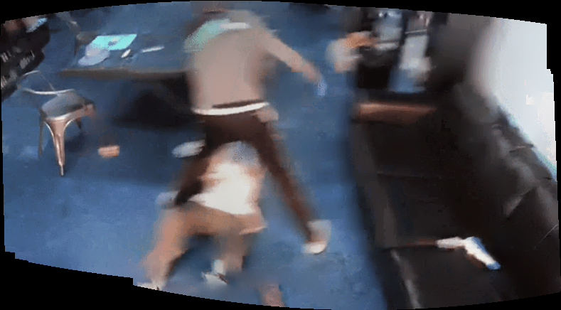
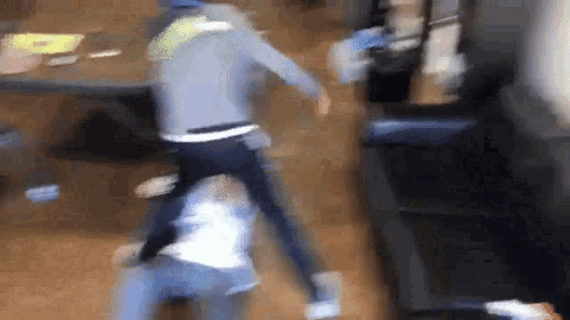

# GIF to Panorama and Full Frame Converter

Этот репозиторий содержит 3 Python-скрипта для обработки GIF-изображений:
1. **`eis_gif.py`** – стабилизировать GIF.
2. **`gif_to_panorama.py`** – создаёт панораму из всех кадров GIF (с учётом движения в любом направлении).
3. **`gif_to_fullframe.py`** – объединяет все кадры GIF в одно изображение с эффектом наложения.

## Примеры работы скриптов:

1. **`Исходное изображение`**:<br>

2. **`Стабилизированное изображение`**:<br>

3. **`Панорама`**:<br>

4. **`Полный кадр.py`**:<br>


## Установка

1. Клонируйте репозиторий:
    ```bash
   git clone https://github.com/ifdancoder/gif-processor.git
   cd gif-processor
   ```
2. Создать и активировать venv:
    ```bash
   python3 -m venv venv
   source venv/bin/activate
   ```
3. Запустить скрипт в venv:
    ```bash
   python eis_gif.py/gif_to_panorama.py/gif_to_fullframe.py <input.gif> <output.gif>
   ```
   